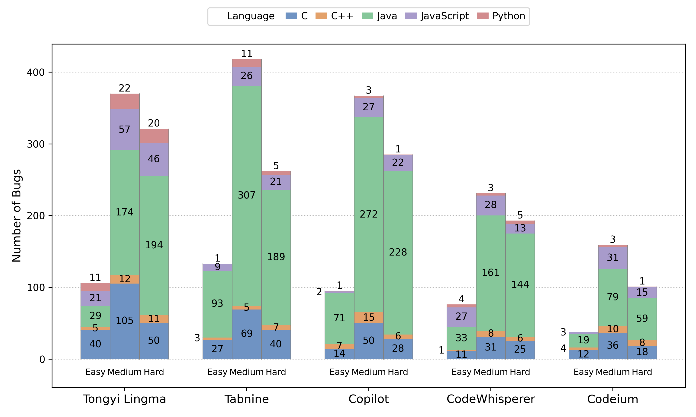

# A Multi-Dimensional Quality Evaluation of Code Generated by LLM-based Tools Across Multiple Programming Languages

- [Introduction](#introduction)  
- [Project Structure and Explanation](#project-structure-and-explanation)    
- [Evaluation Result](#evaluation-result)
- 


---

## Introduction
We collected 2,000 programming problems from LeetCode and tested five mainstream code generation tools: GitHub Copilot, Amazon CodeWhisperer, Tongyi Lingma, Tabnine, and Codeium. Together, they produced 65,325 code suggestions in C, C++, Java, JavaScript, and Python. We recorded their execution results from LeetCode and performed static analysis with Cppcheck and SonarQube, covering four quality dimensions: functional correctness, reliability, maintainability, and complexity.

Our research questions are as follows:

- **RQ1**: What is the functional correctness of the code generated by different LLM-based tools? 
- **RQ2**: What is the reliability of the code generated by different LLM-based tools? 
- **RQ3**: What is the maintainability of the code generated by different LLM-based tools?  
- **RQ4**: How well do these tools control the complexity of their code suggestions?  

---

## Project Structure and Explanation
The repository is organized as follows:

```powershell
├── Figure 
├── Output
   ├── output_TY
   └── output_Tabnine
   └── output_Copilot
   └── output_CodeWhisperer
   └── output_Codeium
├── ProblemInfoCrawler 
├── QualityScan
└── result
   ├── RQ1_Correctness
   └── RQ2_Bug
   └── RQ3_CodeSmell
   └── RQ4_Complexity
```

- **Figure/**: Experimental workflow and result figures.
- **Output/**: All code suggestions, organized by tool, language, and difficulty.
- **ProblemInfoCrawler/**: Scripts for automatically collecting LeetCode problem descriptions, function templates, and problem attributes.
- **QualityScan/**: Scripts for collecting results from static analysis.
- **result/**: Results for RQ1–RQ4.
- **README.md/**: User guidance

## Evaluation Result

### 3.1 ***RQ*1**:  What is the functional correctness of the code generated by different LLM-based tools?


Fig1. Heatmap of the correctness of five tools across different programming languages.


Fig2. Acceptance Rate of Code Suggestions by Problem Difficulty


Fig3. Distribution of error types in the code generated by each tool-language combination

### 3.2 ***RQ*2**:  What is the reliability of the code generated by different LLM-based tools? 



Fig4. Number of buggy code suggestions by tools in different programming languages across difficulty levels

### 3.3 ***RQ*3**:  What is the maintainability of the code generated by different LLM-based tools?  


Fig5. Average number of code smells per code suggestion across programming languages and difficulty
levels

### 3.4 ***RQ*4**: How well do these tools control the complexity of their code suggestions?  


